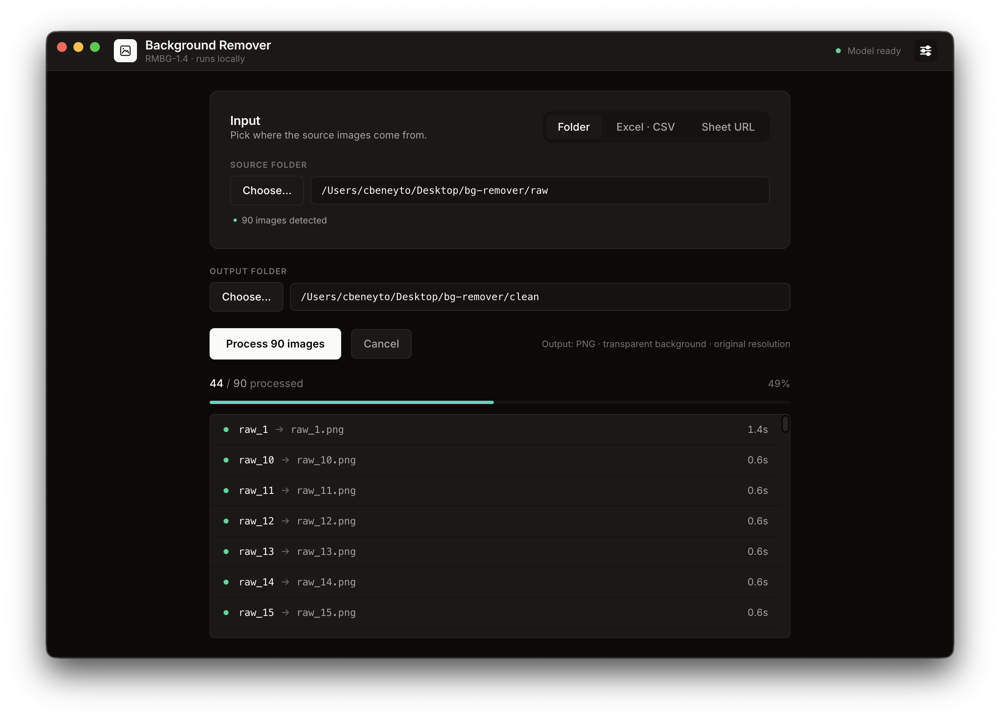
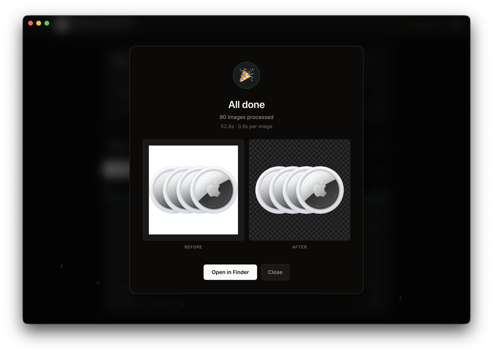

# Background Remover

Cross-platform Electron desktop app that strips backgrounds from
images locally with the RMBG-1.4 model. No cloud, no subscription —
once the weights are downloaded (~180 MB, one time) the app runs
fully offline. Three input modes: a folder of images, an
Excel / CSV file with URLs, or a Google Sheets URL.





---

## Features

- **Three input modes**
  - **Folder** — drop a folder of `.jpg / .jpeg / .png / .webp` and
    every image gets a matching PNG with a transparent background.
  - **Excel · CSV** — pick a local `.xlsx / .csv / .tsv`, choose
    the sheet and the URL column, the worker downloads each row
    and processes it.
  - **Sheet URL** — paste a public Google Sheets URL; the app
    rewrites it to the xlsx export endpoint, downloads, parses,
    same flow.
- **Bake-able URL gotchas** — Google Drive `/file/d/<ID>/view`
  URLs, B&H Photo cdn-cgi wrappers, browser-shaped headers, and a
  content-type guard against HTML 200s are all baked in. The
  90-URL validation set we tested against converts cleanly.
- **Per-job progress** with live phase labels (downloading /
  loading / processing / writing), per-image timing, and a job
  list that scrolls in batch order.
- **Pre-flight count** — picking a folder or column shows
  "X images detected" / "X URLs detected" before you click
  Process, so an empty input is caught immediately.
- **Completion modal** — dark-mode modal regardless of app theme,
  confetti glyph, before / after preview using one real processed
  image, "Open in Finder" CTA, and a copyable list of any
  failures.
- **Settings panel** with:
  - Model: cache size, local revision, re-download, clear cache,
    open in Finder, check for updates against Hugging Face.
  - Appearance: light / dark / system.
  - Language: English / Español (UI strings only; technical
    worker errors stay in English).
  - Edge style: Soft / Balanced / Crisp mask post-processing
    with visual previews.
- **Boot splash** so the window isn't blank during JS parse.
- **macOS + Windows distribution** — DMG for macOS arm64, NSIS
  installer for Windows x64.

---

## Architecture in one diagram

```
Renderer (React 19 + Tailwind, Chromium)
   │  contextBridge → window.api.*
   ▼
Main (Electron Node, electron-vite bundle)
   │  ipcMain.handle("…")
   │  spawn vanilla Node sidecar
   │  ↓  JSONL over stdin/stdout
Worker (vanilla Node binary shipped under Resources/node-bin)
   │  @huggingface/transformers + sharp + onnxruntime-node
   ▼  RMBG-1.4 ONNX inference, writes PNG to output folder
```

The worker is **not** Electron's Node fork — it's a vanilla Node
20 binary we ship under `Resources/node-bin/` alongside the app.
This sidesteps the perennial `@electron/rebuild` ABI dance for
`sharp` and `onnxruntime-node`. Full rationale: see
[`docs/architecture.md`](./docs/architecture.md).

---

## Prerequisites

| Tool | Version | Why |
|---|---|---|
| **Node.js** | 20.x or newer | Runs the toolchain. The bundled sidecar uses Node 20.18.1 specifically. |
| **npm** | 10.x or newer | Comes with Node 20. Lockfile is npm-flavoured (`package-lock.json`). |
| **Xcode Command Line Tools** | latest | macOS only. `iconutil` lives here (used by `npm run icons` to build `.icns`). Install via `xcode-select --install`. |
| **Homebrew** *(optional)* | — | macOS only. Needed if you want to cross-build Windows from Mac (wine). |

You do **not** need a Python / Rust / C++ toolchain. `sharp` and
`onnxruntime-node` ship pre-built native binaries and we run them
via a vanilla Node sidecar — no rebuilding against Electron's ABI.

---

## Quick start (dev)

```bash
git clone git@github.com:cbeneyto/bgremover-app.git
cd bgremover-app
npm install
npm run dev
```

The first `npm run dev` does a one-time worker bundle, then opens
an Electron window with HMR for the renderer.

**Heads up about the dev dock icon:** in `npm run dev` the macOS
dock will say "Electron" because we're launching Electron's
pre-built `Electron.app`, whose `Info.plist` is read by macOS.
The **icon** does get overridden at runtime (you'll see our
custom mark, not the atom logo). The packaged `.dmg` has both
name and icon correct because its `Info.plist` is generated by
electron-builder from `productName` in `package.json` /
`electron-builder.yml`.

---

## Scripts reference

Every command runs from the repo root.

| Command | What it does |
|---|---|
| `npm run dev` | Build the worker bundle once, then start Electron with HMR. |
| `npm run build` | Production-bundle main + preload + renderer + worker into `out/`. |
| `npm run build:worker` | Re-bundle only `out/worker/index.js`. Use this when you edit a `src/worker/*` file while `npm run dev` is running. |
| `npm test` | Run Vitest once (`TZ=UTC`). |
| `npm run test:watch` | Vitest in watch mode. |
| `npm run test:coverage` | Vitest + v8 coverage report + the configured 80 / 75 / 80 / 80 gate. |
| `npm run typecheck` | `tsc --noEmit` for both Node-side and web-side tsconfigs. |
| `npm run icons` | Render `resources/icon.svg` → `resources/icon.png` (1024×1024) and, on macOS, `resources/icon.icns`. Re-run only if you edit the SVG. |
| `npm run fetch-node` | Download Node 20.18.1 binaries for the three target platforms into `resources/node-binaries/`. Idempotent. Auto-runs as part of `pack:*`. |
| `npm run prepare:cross-deps` | Install the platform-specific `@img/sharp-*` packages for every target OS into `node_modules`. Idempotent. Auto-runs as part of `pack:*`. |
| `npm run pack:mac` | Build everything → produce `release/Background Remover-<v>-arm64.dmg`. |
| `npm run pack:win` | Build everything → produce `release/Background Remover Setup <v>.exe`. (Needs wine on macOS — see below.) |
| `npm run pack:all` | Mac + Win in one go. |

---

## Build installers for distribution

### macOS `.dmg` (build on a Mac)

```bash
npm run pack:mac
# → release/Background Remover-0.1.0-arm64.dmg  (~347 MB)
```

The first run downloads Electron's framework binary (~100 MB,
cached after that). Subsequent runs take about a minute on an
M-series Mac. Unsigned by default — see
[*Signing*](#signing) below.

### Windows `.exe` (build on Windows — easiest)

```powershell
npm install
npm run pack:win
# → release\Background Remover Setup 0.1.0.exe
```

That's it. `prepare:cross-deps` will also install the macOS sharp
bins on a Windows machine — they're ~25 MB of dead weight but
otherwise harmless.

### Windows `.exe` cross-build from macOS (needs wine)

```bash
brew install --cask wine-stable
npm run pack:win
# → release/Background Remover Setup 0.1.0.exe
```

The Homebrew cask provides an arm64-native wine. The one
electron-builder downloads itself is x86-only and crashes with
`bad CPU type in executable` on Apple Silicon — that's why we
need the brew install.

Heads-up: `wine-stable` pulls in `gstreamer-runtime` which
installs a `.pkg` to `/Library/Frameworks/` and asks for your
password once. After that it's a one-time setup.

### Fallback: Windows portable ZIP (no wine needed)

`npm run pack:win` on a Mac without wine produces
`release/win-unpacked/` — a fully functional portable folder.
The NSIS wrapper step fails but everything in the folder works.
You can hand-deliver this as a zip:

```bash
cd release && zip -r "Background Remover-win-x64.zip" win-unpacked
```

The recipient extracts the zip and runs `Background Remover.exe`.
Same UX as the installer minus the wizard. See
`docs/packaging.md` for the full recipe.

---

## Distributing to a third party

Both builds are **unsigned** by default. Tell the recipient:

### macOS

> 1. Open the `.dmg`, drag *Background Remover* to Applications.
> 2. First launch only: macOS Gatekeeper says
>    *"Background Remover can't be opened…"*. Click **Cancel**.
> 3. Open Finder → Applications → **right-click**
>    *Background Remover* → **Open** → **Open** in the dialog.
>    macOS remembers it.
> 4. On macOS Sequoia (15) you may need to go to
>    **System Settings → Privacy & Security** and click
>    **Open Anyway** at the bottom.
> 5. First batch downloads the model (~180 MB). Subsequent runs
>    are fully offline.

### Windows

> 1. Run the `.exe`. SmartScreen says
>    *"Windows protected your PC"*. Click **More info** →
>    **Run anyway**.
> 2. NSIS asks for an install location.
> 3. First batch downloads the model (~180 MB).

---

## Signing

Both installers ship **unsigned** today. For internal distribution
inside a small team this is acceptable; the recipient performs a
one-time bypass and the OS remembers the choice. For external
customers it kills adoption.

To productionise:

| Step | Cost | Effort |
|---|---|---|
| Apple Developer Program | $99 / year | Generate a Developer ID Application cert, set `mac.identity`, run `notarytool` after `pack:mac` |
| EV code-signing cert (Windows) | ~$300 / year | Buy from DigiCert / Sectigo, configure `win.certificateSubjectName` |

---

## Settings + features in the app

The settings drawer (sliders icon, top-right) exposes:

- **Appearance**: Light / Dark / System. Persists between sessions.
- **Language**: English / Español. Persists between sessions.
- **Model**: cache size, local revision, four buttons:
  - **Download / Re-download** — pulls weights from Hugging Face.
  - **Clear cache** — wipes the cache + restarts the worker.
  - **Open in Finder** — opens the model cache dir.
  - **Check for updates** — compares local SHA against HF API.
- **Edge style**: how the raw model mask becomes the alpha
  channel of the output PNG. Three modes with visual previews:
  - **Soft** (default) — natural antialiased edges. Best for
    hair, fur, fabric, glass.
  - **Balanced** — S-curve over the mask. Cleaner edges, less
    halo. Best for mixed catalogue photos.
  - **Crisp** — binary threshold at 128. Every pixel is fully
    opaque or fully transparent. Best for product shots on flat
    backgrounds.
- **About**: app / Electron / Node versions, model cache path.

See [`docs/settings.md`](./docs/settings.md) for implementation
details.

---

## Where files live at runtime

| Thing | Path on macOS | Path on Windows |
|---|---|---|
| App data | `~/Library/Application Support/Background Remover/` | `%APPDATA%\Background Remover\` |
| Model weights | …`/models/briaai/RMBG-1.4/` | …\models\briaai\RMBG-1.4\ |
| Settings (localStorage backing) | inside Electron's Local Storage at app data | same |
| Output PNGs | wherever you picked as the **Output folder** | same |

To start fresh: quit the app, delete the *Background Remover*
folder above, relaunch. The model re-downloads on next run.

---

## Project structure

```
bgremover-app/
├── README.md                       this file
├── docs/                           canonical deep dives — start at docs/README.md
│   ├── README.md
│   ├── architecture.md
│   ├── getting-started.md
│   ├── ipc-protocol.md
│   ├── worker.md
│   ├── renderer.md
│   ├── design.md
│   ├── model.md
│   ├── input-modes.md
│   ├── settings.md
│   ├── testing.md
│   ├── packaging.md
│   ├── smoke-tests.md
│   └── gotchas.md
├── electron-builder.yml            installer config
├── electron.vite.config.ts         main + preload + renderer build
├── vite.worker.config.ts           sidecar worker build
├── package.json
├── resources/
│   ├── icon.svg                    source of truth for the brand mark
│   ├── icon.png                    generated 1024×1024 PNG
│   ├── icon.icns                   generated macOS bundle
│   └── node-binaries/              fetched Node sidecars (gitignored)
├── scripts/
│   ├── download-node-binaries.mjs  npm run fetch-node
│   ├── generate-icons.mjs          npm run icons
│   └── install-cross-deps.mjs      npm run prepare:cross-deps
└── src/
    ├── shared/                     types + pure helpers (jsonl, theme-resolver, create-store)
    ├── main/                       Electron main process
    │   ├── index.ts                lifecycle, window
    │   ├── ipc.ts                  every ipcMain.handle
    │   ├── worker-bridge.ts        spawn + JSONL framing
    │   ├── model-manager.ts        cache dir + status state machine
    │   └── input-resolver.ts       exceljs + papaparse + Google Sheets rewrite
    ├── preload/
    │   └── index.ts                contextBridge → window.api
    ├── renderer/                   React 19 app
    │   ├── App.tsx
    │   ├── components/             InputModeTabs, PathPicker, ColumnSelector,
    │   │                           ProgressList, ModelDownloadBanner,
    │   │                           SettingsDrawer, DoneDialog
    │   ├── hooks/                  useSettings, useJobs, useModelStatus,
    │   │                           useTheme, useTranslate
    │   ├── i18n/                   en.ts, es.ts, index.ts
    │   └── styles/globals.css
    └── worker/                     sidecar Node
        ├── index.ts                JSONL stdin reader, queue, dispatch
        ├── background-removal.ts   RMBG-1.4 wrapper (verbatim port)
        ├── fetch-image.ts          HTTP fetch with content-type guard
        ├── url-rewrite.ts          pure URL gotchas (Drive viewer, B&H CDN)
        ├── mask-postprocess.ts     edge-mode post-processing
        └── temp-source.ts          URL-source stash for the done-modal preview
```

---

## Testing

- **90 unit tests** with Vitest, all pure-logic with zero mocks.
- **Coverage gate** at 92.63% lines / 89.01% branches / 95.45%
  functions, enforced on six explicitly-listed files
  (`src/shared/jsonl.ts`, `src/shared/create-store.ts`,
  `src/shared/theme-resolver.ts`, `src/main/input-resolver.ts`,
  `src/worker/url-rewrite.ts`, `src/worker/mask-postprocess.ts`).
- Electron lifecycle, IPC handlers, the model runtime, and the
  React UI are deliberately not in the unit-test gate — they're
  verified by the manual smoke-test checklist in
  [`docs/smoke-tests.md`](./docs/smoke-tests.md).

```bash
npm test                # one-shot
npm run test:watch      # interactive
npm run test:coverage   # one-shot + gate
```

See [`docs/testing.md`](./docs/testing.md) for the full coverage
matrix and why each layer is or isn't unit-tested.

---

## Troubleshooting

### "Loading…" stays forever on first launch
The boot splash hides itself as soon as React mounts. If it
doesn't, the JS bundle failed to load — open the browser-style
devtools (`Cmd+Opt+I` on macOS, `Ctrl+Shift+I` on Windows) and
check the Console for an error.

### "Model not yet downloaded" on every launch
This was a real bug fixed in commit history — `@huggingface/transformers`
doesn't read the Python HF env vars, it uses its own
`env.cacheDir`. The fix is in
[`src/worker/background-removal.ts`](./src/worker/background-removal.ts)
`setCacheDir()`. If you still see it, your cache may be stale:
delete `~/Library/Application Support/Background Remover/models/`
(macOS) or `%APPDATA%\Background Remover\models\` (Windows) and
relaunch. See [`docs/gotchas.md`](./docs/gotchas.md).

### Banner stays "Downloading… 100%"
Trust-the-worker fix: the `ready` event from the worker now
flips the status to ready directly, no disk verification.
Documented in
[`docs/gotchas.md`](./docs/gotchas.md). If it still happens,
check the terminal where `npm run dev` is running — there'll be
a worker error on stderr.

### Cancel batch leaves the app unable to start the next one
Worker auto-respawn on exit ships in the bridge — see
[`src/main/worker-bridge.ts`](./src/main/worker-bridge.ts).
Fixed.

### `npm run pack:win` fails with `bad CPU type in executable`
You're cross-building from Apple Silicon. Install
`brew install --cask wine-stable` (arm64-native wine) or build
on Windows directly.

### `EBADPLATFORM` when running `npm install` of cross-platform sharp
Run `npm run prepare:cross-deps` — it uses `--force` to install
foreign-platform `@img/sharp-*` packages without npm's normal
platform rejection.

### Settings drawer Theme toggle doesn't propagate to the app
Was a real bug — `useSettings` used per-call `useState` so the
drawer's writes weren't visible to `App.tsx`. Replaced with a
shared store. See
[`src/shared/create-store.ts`](./src/shared/create-store.ts).
Fixed.

---

## Deep dives

Everything below has a dedicated doc in `docs/`:

- [`docs/architecture.md`](./docs/architecture.md) — three-process layout, build pipeline, stack rationale
- [`docs/ipc-protocol.md`](./docs/ipc-protocol.md) — renderer ↔ main IPC + worker JSONL protocol
- [`docs/worker.md`](./docs/worker.md) — RMBG-1.4 wrapper, sharp compositing, URL gotchas
- [`docs/renderer.md`](./docs/renderer.md) — React state model, hook contracts
- [`docs/design.md`](./docs/design.md) — palette, type scale, motion budget
- [`docs/model.md`](./docs/model.md) — model cache + download + offline fallback
- [`docs/input-modes.md`](./docs/input-modes.md) — folder / Excel-CSV / URL flows
- [`docs/settings.md`](./docs/settings.md) — settings drawer + storage
- [`docs/testing.md`](./docs/testing.md) — Vitest setup, what's covered
- [`docs/packaging.md`](./docs/packaging.md) — full installer recipes + the wine story
- [`docs/smoke-tests.md`](./docs/smoke-tests.md) — manual per-release checklist
- [`docs/gotchas.md`](./docs/gotchas.md) — known rough edges + fixes

---

## License

GPL-3.0-or-later. See [`LICENSE`](./LICENSE).
